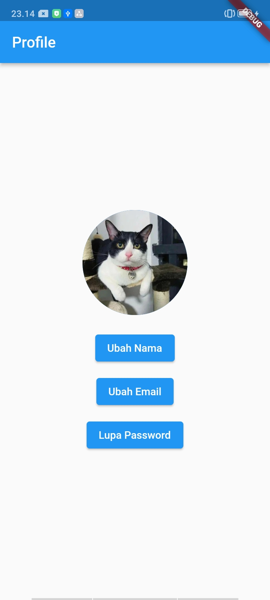

# MP-HandsOn2-Flutter

Aplikasi Flutter yang dibuat untuk keperluan *hands-on* 3 Mobile Programing GDGoC.

## Deskripsi

Aplikasi ini dibuat sebagai bagian dari latihan *hands-on* 3 untuk mempelajari penggunaan flutter widget. Aplikasi ini menampilkan profile picture yang disertai button untuk mengubah nama, mengubah email dan juga button lupa password.
## Screenshot

Berikut adalah tampilan dari aplikasi ini:

## Teknologi yang Digunakan

*   Flutter
*   Dart
*   package:flutter/material.dart
